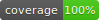

# template_ds_project

<p align="center">
  <a href="" rel="noopener">
 </a>
</p>

<h3 align="center">TERMICA - Projeto 0</h3>
<h3 align="center">i2a2_proj03</h3>

<div align="center">

  []()
</div>

---


## 🧐 About <a name = "about"></a>

CRISP-DS applied to Lotofacil lottery raffles

A planilha em anexo, contém todos as informações disponibilizadas sobre os sorteios da Lotofácil, desde o primeiro sorteio.
De todas as loterias da Caixa Econômica esta é a que tem a maior probabilidade de premiação (basta olharem a coluna de ganhadores com 11 números).
As regras de funcionamento atual desta loteria, vocês encontrarão no site da Caixa Econômica Federal (https://loterias.caixa.gov.br/Paginas/Lotofacil.aspx)
Observem que as regras mudaram ligeiramente ao longo do tempo e isto está refletido nos dados.
Adicionalmente, na planilha vocês encontrarão uma coluna chamada Id que é um identificador binário do sorteio realizado e os números sorteados em ordem crescente e ordem de sorteio.
A coluna da Cidade contém os municípios ou os estados onde houveram ganhadores com 15 números.
Eventualmente, não há ganhadores com 15 números, então o valor é acumulado para o próximo sorteio. Isto pode ser notado quando na coluna Ganhadores 15 Números há valor 0.
Se vocês pesquisarem na internet, encontrarão diversas combinações mágicas e infalíveis, sequencias tanto dentro do próprio sorteio quanto entre sorteios, e assim por diante.
A tarefa de vocês é:
1. Criar um ou mais notebooks utilizando esta base.
2. Efetuar a limpeza dos dados
3. Efetuar a análise exploratória dos dados
4. Utilizado as dicas "mágicas" encontradas na internet, fazer a engenharia de features para criar novos atributos em sua base (P.ex. quantidade de números pares, números repetidos em relação ao sorteio anterior, etc.)
5. Utilizar os algoritmos estudados nesta semana e nas duas semanas seguintes para criar um modelo que faça a previsão dos números sorteados.
6. É muito, muito, muito provável que vocês não terão sucesso na etapa 5. Então, temos algumas perguntas para responder:
	6.a. Porque não tive sucesso.
	6.b. Qual a entropia destes dados?
	6.c. Qual modelo teve o melhor resultado e porque?
O Estudo deve seguir a metodologia CRISP-DS, descrevendo as etapas realizadas.
Ao final, coloquem também seus comentários.


## 🔖 Project structure

```
i2a2_proj03/
|- bin/          # contains scripts and main files that should be run
|- config/       # config files
|- data/         # local data files needed for the project
|- notebooks/    # notebooks for EDA and exploration
|- secrets       # contains api keys and secret parameters. It should be ignored from git
|- src/          # source code - contains functions
|- tests/        # Test files should mirror the src folder
|- Makefile      # automatize taks through make utility
```
Structure based on https://github.com/kaislar/ds_template


## 🏁 Getting Started <a name = "getting_started"></a>
These instructions will get you a copy of the project up and running on your local machine for development and testing purposes.

### Clone the project 
```
git clone git@github.com:mcemim/i2a2_proj03.git
```

## Setup your environement and install project dependencies
```
conda create -n i2a2_proj03 python=3.10
source activate i2a2_proj03


python -m pip install pip-tools
pip-compile --output-file requirements.txt requirements.in requirements_dev.in
python -m pip install -r requirements.txt
```

### Installing

## 🔧 Running the tests
Tests are implemented in ./tests, you need to run the following command to run them.
```
make tests
```

## 🚀 Deployment
Add additional notes about how to deploy this on a live system.

## 🎈 Contributions
To contribute in this project, please setup locally the project following the steps  in Getting started section.
We use few packages to guarantee high quality code. Before commiting you can run:
To format you code using black
```
make black
```
To get warning message on non respect of pep8 code guidance:
(the command runs on all .py files in the project)
```
make lint
```
You can also run automatically, black, lint and few other packages to analyze and check your code base before commiting
```
make precommit
```

##  ✍️ Authors
Marcos Cemim - mcemim@gmail.com
